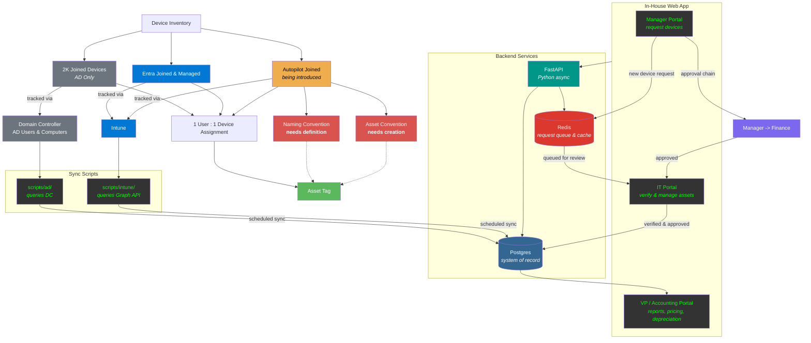

# Device Inventory Overview

```mermaid
graph TD
    INV[Device Inventory]

    INV --> AD[2K Joined Devices<br><i>AD Only</i>]
    INV --> ENTRA[Entra Joined & Managed]
    INV --> AP[Autopilot Joined<br><i>being introduced</i>]

    AD -->|tracked via| DC[Domain Controller<br>AD Users & Computers]
    ENTRA -->|tracked via| INTUNE[Intune]
    AP -->|tracked via| INTUNE

    AD --> ASSIGN[1 User : 1 Device Assignment]
    ENTRA --> ASSIGN
    AP --> ASSIGN

    ASSIGN --> ASSET[Asset Tag]

    AP --> NC[Naming Convention<br><b>needs definition</b>]
    AP --> AC[Asset Convention<br><b>needs creation</b>]
    NC -.-> ASSET
    AC -.-> ASSET

    subgraph WEBAPP [In-House Web App]
        direction TB
        PORTAL_MGR[Manager Portal<br><i>request devices</i>]
        PORTAL_IT[IT Portal<br><i>verify & manage assets</i>]
        PORTAL_EXEC[VP / Accounting Portal<br><i>reports, pricing, depreciation</i>]
    end

    subgraph BACKEND [Backend Services]
        direction TB
        FASTAPI[FastAPI<br><i>Python async</i>]
        POSTGRES[(Postgres<br><i>system of record</i>)]
        REDIS[(Redis<br><i>request queue & cache</i>)]
    end

    subgraph SCRIPTS [Sync Scripts]
        direction TB
        AD_SCRIPTS[scripts/ad/<br><i>queries DC</i>]
        INTUNE_SCRIPTS[scripts/intune/<br><i>queries Graph API</i>]
    end

    DC --> AD_SCRIPTS
    INTUNE --> INTUNE_SCRIPTS

    AD_SCRIPTS -->|scheduled sync| POSTGRES
    INTUNE_SCRIPTS -->|scheduled sync| POSTGRES

    PORTAL_MGR -->|new device request| REDIS
    REDIS -->|queued for review| PORTAL_IT
    PORTAL_IT -->|verified & approved| POSTGRES
    POSTGRES --> PORTAL_EXEC

    FASTAPI --> POSTGRES
    FASTAPI --> REDIS
    WEBAPP --> FASTAPI

    PORTAL_MGR -->|approval chain| APPROVAL[Manager -> Finance]
    APPROVAL -->|approved| PORTAL_IT

    style AD fill:#6c757d,color:#fff
    style DC fill:#6c757d,color:#fff
    style ENTRA fill:#0078d4,color:#fff
    style INTUNE fill:#0078d4,color:#fff
    style AP fill:#f0ad4e,color:#000
    style NC fill:#d9534f,color:#fff
    style AC fill:#d9534f,color:#fff
    style ASSET fill:#5cb85c,color:#fff
    style POSTGRES fill:#336791,color:#fff
    style REDIS fill:#dc382d,color:#fff
    style FASTAPI fill:#009688,color:#fff
    style APPROVAL fill:#7b68ee,color:#fff
    style PORTAL_MGR fill:#333,color:#0f0
    style PORTAL_IT fill:#333,color:#0f0
    style PORTAL_EXEC fill:#333,color:#0f0
    style AD_SCRIPTS fill:#333,color:#0f0
    style INTUNE_SCRIPTS fill:#333,color:#0f0
```
